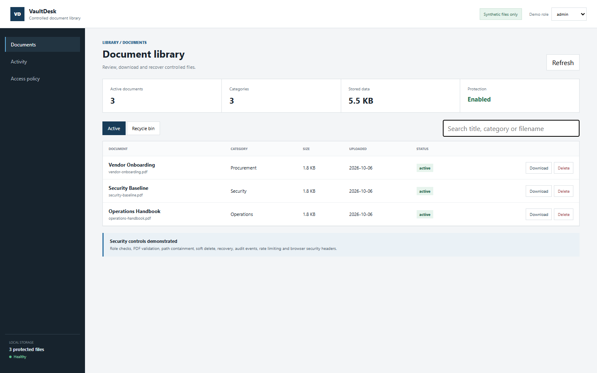

# Secure Document Library Demo

A sanitized FastAPI document portal that demonstrates access control and defensive file handling with generated PDFs.



## Security controls

- Viewer, editor and admin demo roles with server-side authorization.
- Strict PDF extension, filename and content checks.
- Resolved-path containment to block path traversal.
- Soft delete and explicit recovery from an isolated recycle directory.
- Audit events for upload, deletion and restore operations.
- Request rate limiting and browser hardening headers.
- Two-megabyte demo upload ceiling.

## Run

```bash
python -m venv .venv
.venv\Scripts\activate
python -m pip install -r requirements.txt
python -m uvicorn app.main:app --reload
```

Open `http://127.0.0.1:8000`. Three fictional PDFs are generated on first run.

## Test

```bash
pytest -q
```

## Scope

This project was rebuilt with a fresh history. It contains no institutional documents, names, account data, credentials or production storage paths. The header-based roles are intentionally a transparent demo mechanism, not production authentication.

## License

MIT
